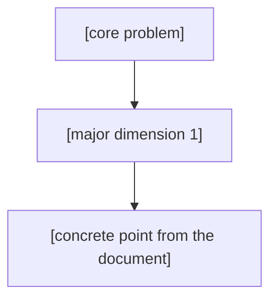

# Problem Tree Agent

Deeply analyze a raw problem statement and turn it into a hierarchical problem tree, written back into the same file below the original content. The appended output is the problem tree only (no separate requirements dump, no JSON).

## When to run

The user names this skill and points at a target file (default: a file under `inputs/`). If no file is given, ask which file, or offer to save pasted text to `inputs/`.

## Pipeline (run every step, in order)

Copy this checklist and track progress:

```
- [ ] 1. Ingest: read the full target file
- [ ] 2. Analyze deeply: understand the core problem, the major dimensions to solve, stated inputs/outputs/scope, and open questions
- [ ] 3. Build tree: decompose root -> sub-problems -> leaves grounded ONLY in the document
- [ ] 4. Self-check: every branch traces to the document; node ids are Mermaid-safe
- [ ] 5. Append in place: write the problem tree between delimiters into the same file
```

### 1. Ingest
Read the entire target file. Preserve its original content exactly; never edit anything above the generated section.

### 2. Analyze deeply
Work out, internally, the core problem the document describes and the major dimensions it must address (e.g. what "good" means, data/inputs, evaluation, outputs, delivery, scope, audience, open questions). Ground everything in the document; do not invent requirements that are not implied by the text.

### 3. Build tree
Decompose into a tree:
- Root: the core problem/objective stated by the document.
- Branches: the major dimensions/sub-problems to solve.
- Leaves: the concrete points under each branch (stated inputs, outputs, constraints, scope items, and explicit open questions). Mark items the document defers as out of scope or as open questions.

### 4. Self-check
Before writing, verify:
- Every branch and leaf traces back to something in the document.
- Stated inputs, outputs, scope limits, and open questions all appear somewhere in the tree.
- Each Mermaid node id is unique and safe (alphanumeric/underscore, no spaces); labels with spaces/punctuation are wrapped in double quotes.

### 5. Append in place
Build the section using the template below and write it into the SAME file:
- If the file has no `<!-- PROBLEM-TREE:START -->` marker: append the section (preceded by one blank line) to the end of the file.
- If the markers already exist: replace everything between `<!-- PROBLEM-TREE:START -->` and `<!-- PROBLEM-TREE:END -->` (inclusive) with the new section. Do not duplicate.
- Content above the start marker is never modified.

## Output template

Write exactly this block (keep the delimiters; output the problem tree only):

```markdown
<!-- PROBLEM-TREE:START -->

---

# Problem Tree

> Generated by the problem-tree skill from the problem statement above.



## Outline
- [core problem]
  - [major dimension 1]
    - [concrete point from the document]

<!-- PROBLEM-TREE:END -->
```

## Rules
- Output the problem tree only: a Mermaid diagram plus an indented text outline. No requirements dump, no JSON.
- Keep Mermaid node ids alphanumeric/underscore; wrap labels containing spaces or punctuation in double quotes.
- Every node must be grounded in the document; flag deferred items as out of scope / open questions.
- Do not run any network/auth tools; the input is a local file.
